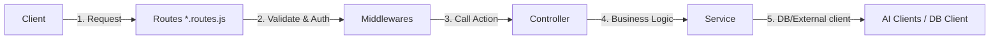

# HƯỚNG DẪN CẤU TRÚC BACKEND & QUY CHUẨN PHÁT TRIỂN (REFACTORING GUIDELINE)

Tài liệu này dành cho lập trình viên Backend để hiểu rõ cấu trúc thư mục mới sau khi refactor, lý do đằng sau các thay đổi và quy trình chuẩn để phát triển các tính năng tiếp theo mà không phá vỡ tính nhất quán hệ thống.

---

## 1. Bối cảnh & Lý do Refactor

Trước đây, cấu trúc mã nguồn của thư mục `backend` gặp một số vấn đề lớn:
*   **Cấu trúc bất nhất:** Module `auth` có Controller riêng, nhưng `chatbot`, `courses`, `progress` lại khai báo route, xử lý dữ liệu giả lập và mock client lộn xộn trong cùng một file Router.
*   **Lỗ hổng bảo mật nghiêm trọng:** Khởi chạy server có cơ chế fallback `JWT_SECRET` về một chuỗi mặc định hardcode. Nếu quên cấu hình biến môi trường trên Production, hệ thống sẽ bị lỗ hổng bảo mật nghiêm trọng.
*   **Nguy cơ DoS (Denial of Service):** Cấu hình giới hạn payload body JSON lên tới `50mb` cho toàn bộ các route thông thường, dẫn tới nguy cơ Event Loop bị nghẽn và cạn kiệt bộ nhớ nếu bị spam request lớn.
*   **Sai chuẩn RESTful API:** Khi Chatbot xảy ra lỗi hệ thống, service tự ý catch lỗi và trả về JSON có cờ `error: true` nhưng HTTP Status Code vẫn là `200 OK`.
*   **Thiếu Validate dữ liệu đầu vào:** Chưa có cơ chế validation tập trung để chặn đứng các request rác trước khi đi vào xử lý sâu.

---

## 2. Kiến trúc thư mục mới (Modular Monolith)

Cấu trúc thư mục hiện tại đã được chuẩn hóa đồng nhất:

```text
backend/
├── src/
│   ├── middleware/
│   │   ├── auth.middleware.js       # Xác thực JWT Token
│   │   ├── error.middleware.js      # Global Error Handler tập trung
│   │   ├── logger.middleware.js     # Ghi nhận log request
│   │   └── validation.middleware.js  # [NEW] Middleware Validate Schema
│   │
│   ├── modules/
│   │   ├── auth/
│   │   │   ├── controllers/
│   │   │   │   └── auth.controller.js
│   │   │   ├── services/
│   │   │   │   └── auth.service.js   # [NEW] Logic nghiệp vụ
│   │   │   └── auth.routes.js        # [RENAMED] Định nghĩa routes & validate
│   │   │
│   │   ├── chatbot/
│   │   │   ├── controllers/
│   │   │   │   └── chatbot.controller.js # [NEW] Nhận request & phản hồi
│   │   │   ├── services/
│   │   │   │   └── chatbot.service.js
│   │   │   └── chatbot.routes.js     # [RENAMED] Định nghĩa route & validate
│   │   │
│   │   ├── courses/
│   │   │   ├── controllers/
│   │   │   │   └── courses.controller.js # [NEW]
│   │   │   ├── services/
│   │   │   │   └── courses.service.js    # [NEW]
│   │   │   └── courses.routes.js        # [RENAMED]
│   │   │
│   │   └── progress/
│   │       ├── controllers/
│   │       │   └── progress.controller.js # [NEW]
│   │       ├── services/
│   │       │   └── progress.service.js    # [NEW]
│   │       └── progress.routes.js        # [RENAMED]
│   │
│   ├── utils/
│   │   └── ai-clients.js             # [NEW] Cô lập kết nối Gemini/Pinecone
│   │
│   └── server.js                     # Entry point khởi chạy app
└── .env                              # Biến môi trường
```

---

## 3. Quy trình dòng chảy dữ liệu (Data Flow)

Mọi request từ Client đi vào hệ thống sẽ tuân thủ nghiêm ngặt mô hình 4 tầng sau:



1.  **Routes Layer (`*.routes.js`):** Định nghĩa endpoint, đính kèm các Middleware tương ứng (Xác thực, Phân quyền, Validate dữ liệu).
2.  **Controller Layer (`*.controller.js`):** Chỉ làm nhiệm vụ trích xuất tham số từ request (`req.body`, `req.params`, `req.query`), gọi hàm tương ứng trong Service và định nghĩa HTTP Status Code phản hồi (`200`, `201`, `400`, v.v.). **Tuyệt đối không viết logic nghiệp vụ tại đây.**
3.  **Service Layer (`*.service.js`):** Chứa toán bộ logic nghiệp vụ (Business Logic), thực hiện các phép tính toán, gọi DB hoặc các Client bên ngoài. Nếu có lỗi phát sinh, hãy `throw` lỗi cụ thể để Global Error Handler xử lý.
4.  **Infrastructure/Clients (`utils/` hoặc `config/`):** Tách biệt các SDK liên kết ngoài như Pinecone, Gemini Client để dễ bảo trì và viết Unit Test độc lập.

---

## 4. Các cơ chế Kỹ thuật Quan trọng

### A. Middleware Validate dữ liệu đầu vào (`validation.middleware.js`)
Không cần cài thêm các thư viện cồng kềnh, chúng ta viết một bộ Validator gọn nhẹ dựa trên cấu trúc Schema:

*   **Cách sử dụng trong file Route:**
    ```javascript
    const validate = require('../../middleware/validation.middleware');

    const registerSchema = {
      body: {
        email: { required: true, isEmail: true },
        password: { required: true, minLength: 6 },
        username: { required: true }
      }
    };

    router.post('/register', validate(registerSchema), authController.register);
    ```
*   **Các thuộc tính hỗ trợ:** `required` (bắt buộc phải có và không rỗng), `isEmail` (phải đúng định dạng email), `minLength` (độ dài tối thiểu của chuỗi).

### B. Cơ chế bảo vệ Server tại Khởi tạo (`server.js`)
Để tránh việc chạy sai cấu hình ở môi trường thực tế:
```javascript
if (!process.env.JWT_SECRET) {
  console.error('\n❌ FATAL ERROR: JWT_SECRET không được định nghĩa trong biến môi trường.');
  console.error('Hệ thống dừng khởi động để đảm bảo an ninh.\n');
  process.exit(1);
}
```
*Lập trình viên khi deploy dự án cần chắc chắn đã tạo file `.env` chứa `JWT_SECRET`.*

### C. Giới hạn Payload phòng chống DoS
```javascript
app.use(express.json({ limit: '1mb' }));
app.use(express.urlencoded({ limit: '1mb', extended: true }));
```
Hạn chế tối đa dung lượng JSON payload ở mức `1mb`. Nếu có route cần upload file lớn, cấu hình riêng middleware giới hạn (ví dụ sử dụng `multer`) cho chính route đó, tránh cấu hình global.

### D. Chuẩn hóa Error Handling
Khi xảy ra lỗi ở tầng Service, tuyệt đối không dùng block `try-catch` để trả về JSON dạng `{ success: false, message: ... }` với status code `200`. Hãy định nghĩa lỗi rõ ràng:
```javascript
const error = new Error('Dịch vụ gặp sự cố');
error.name = 'ChatbotError'; // hoặc ValidationError, DatabaseError, v.v.
error.status = 503;
throw error;
```
Lỗi này sẽ tự động được đưa về `src/middleware/error.middleware.js` để trả ra đúng mã trạng thái HTTP RESTful tương ứng cho Client.

---

## 5. Hướng dẫn thêm một Tính năng/Module mới (Từng bước)

Giả sử bạn cần thêm tính năng **Quản lý Bài tập (Exercises)**:

1.  **Bước 1:** Tạo thư mục `src/modules/exercises`.
2.  **Bước 2:** Tạo file Service `src/modules/exercises/services/exercises.service.js` để xử lý logic:
    ```javascript
    class ExercisesService {
      async getExercisesByCourse(courseId) {
        // Tương tác DB
        return [{ id: 1, question: "Fill in the blank..." }];
      }
    }
    module.exports = new ExercisesService();
    ```
3.  **Bước 3:** Tạo file Controller `src/modules/exercises/controllers/exercises.controller.js`:
    ```javascript
    const exercisesService = require('../services/exercises.service');

    exports.getByCourse = async (req, res, next) => {
      try {
        const { courseId } = req.params;
        const data = await exercisesService.getExercisesByCourse(courseId);
        res.status(200).json({ success: true, data });
      } catch (error) {
        next(error);
      }
    };
    ```
4.  **Bước 4:** Tạo file Routes `src/modules/exercises/exercises.routes.js`:
    ```javascript
    const express = require('express');
    const router = express.Router();
    const exercisesController = require('./controllers/exercises.controller');
    const validate = require('../../middleware/validation.middleware');

    const schema = {
      params: {
        courseId: { required: true }
      }
    };

    router.get('/course/:courseId', validate(schema), exercisesController.getByCourse);

    module.exports = router;
    ```
5.  **Bước 5:** Đăng ký Route mới trong `src/server.js`:
    ```javascript
    const exercisesRoutes = require('./modules/exercises/exercises.routes');
    app.use('/api/exercises', exercisesRoutes);
    ```

---

*Mã nguồn đã được refactor hoàn chỉnh và kiểm thử tích hợp thành công. Vui lòng tuân thủ quy chuẩn này khi phát triển hệ thống.*
