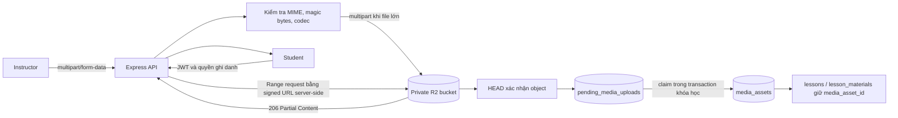

# Kiến trúc media trên Cloudflare R2

## Quyết định

Dự án dùng một R2 Standard bucket private làm nơi chứa video bài giảng, PDF, audio và ảnh dung lượng lớn. PostgreSQL chỉ giữ UUID, vị trí object, MIME, dung lượng, SHA-256 và trạng thái vòng đời trong `media_assets`.

Không chọn R2 Infrequent Access cho nội dung bài học đang mở bán. Gói này không có Free Tier, tính phí đọc dữ liệu và giữ thời gian tính phí tối thiểu 30 ngày. Standard phù hợp hơn vì học viên đọc video/PDF thường xuyên.

R2 Standard hiện có phần miễn phí hàng tháng gồm 10 GB-month, 1 triệu Class A operations và 10 triệu Class B operations; egress trực tiếp từ R2 không tính phí. Xem bảng giá đang áp dụng tại [Cloudflare R2 Pricing](https://developers.cloudflare.com/r2/pricing/).

## Luồng dữ liệu



Trình duyệt không nhận access credential của R2. Với video, backend giữ signed URL ở phía máy chủ rồi proxy từng byte range; cách này bảo toàn ticket/cookie và giới hạn tải song song đã có trong dự án. PDF đi qua endpoint có kiểm tra quyền. Ảnh thực sự công khai có thể chuyển sang custom domain sau, nhưng không nên dùng miền `r2.dev` ở production vì Cloudflare áp dụng rate limit không cố định cho miền này. Xem [R2 limits](https://developers.cloudflare.com/r2/platform/limits/).

## Cấu trúc object

Một bucket, ví dụ `elearning-media`, chia dữ liệu bằng prefix:

```text
courses/{instructorId}/{assetId}/source.mp4
courses/{instructorId}/{assetId}/manifest.mpd
courses/{instructorId}/{assetId}/video.mp4
courses/{instructorId}/{assetId}/audio.mp4
courses/{instructorId}/{assetId}/{document}.pdf
courses/{instructorId}/{assetId}/audio/{recording}.mp3
courses/{instructorId}/{assetId}/image/{thumbnail}.webp
migrated/supabase/{oldBucket}/{oldObjectPath}
```

Video lớn dùng multipart với part 64 MiB và tối đa ba part chạy đồng thời. Cloudflare khuyên multipart cho file khoảng trên 100 MB vì có thể tải lại riêng part lỗi; một lần PUT chỉ nên dành cho file nhỏ hoặc vừa. Giới hạn hiện tại là 5 GiB cho single-part và 5 TiB cho multipart. Tham khảo [Upload objects](https://developers.cloudflare.com/r2/objects/upload-objects/).

## Database

`media_assets` là bảng metadata chuẩn. Hai bảng nghiệp vụ liên kết qua `lessons.media_asset_id` và `lesson_materials.media_asset_id`; `courses.thumbnail_media_id` cùng `users.avatar_media_id` đã sẵn sàng cho ảnh lớn.

Các cột `storage_provider`, `storage_bucket`, `storage_key`, `mime_type`, `size_bytes`, `checksum_sha256`, `media_status` cũ vẫn còn trong một đợt phát hành. Trigger đồng bộ chúng sang `media_assets`, nhờ vậy frontend và các job phụ đề cũ không hỏng ngay trong ngày chuyển đổi. Sau khi log production cho thấy không còn consumer đọc các cột cũ, có thể xóa chúng bằng migration riêng.

Database không chứa `BYTEA`, base64 hay binary payload cho media. Bản ghi mới dùng `storage_provider='r2'`.

## Tạo bucket và credential

1. Mở Cloudflare Dashboard, vào **Storage & databases > R2** rồi tạo bucket private `elearning-media`.
2. Tạo R2 API token chỉ có Object Read & Write trên đúng bucket này. Không dùng Global API key.
3. Chép Account ID, Access Key ID và Secret Access Key vào secret manager của môi trường chạy backend.
4. Không đưa các giá trị thật vào Git, Docker image hoặc biến `VITE_*`.

PDF preview hiện chuyển hướng sang signed GET URL, vì vậy bucket cần CORS cho frontend. Thay `https://app.example.com` bằng domain thật; chỉ giữ localhost ở môi trường dev.

```json
[
  {
    "AllowedOrigins": ["https://app.example.com", "http://localhost:3001"],
    "AllowedMethods": ["GET", "HEAD"],
    "AllowedHeaders": ["Range", "Content-Type"],
    "ExposeHeaders": ["Accept-Ranges", "Content-Length", "Content-Range", "ETag"],
    "MaxAgeSeconds": 3600
  }
]
```

Cloudflare cũng khuyên giới hạn `Content-Type` trong chữ ký PUT nếu sau này frontend upload thẳng vào R2. Bản triển khai hiện tại chưa dùng direct PUT vì backend còn phải kiểm tra MP4/PDF, đóng gói DRM và tạo checksum. Xem [Presigned URLs](https://developers.cloudflare.com/r2/api/s3/presigned-urls/).

Backend dùng endpoint S3-compatible `https://<ACCOUNT_ID>.r2.cloudflarestorage.com`, region `auto`, đúng theo [ví dụ AWS SDK JavaScript của Cloudflare](https://developers.cloudflare.com/r2/objects/upload-objects/).

```dotenv
R2_ACCOUNT_ID=...
R2_ACCESS_KEY_ID=...
R2_SECRET_ACCESS_KEY=...
R2_BUCKET=elearning-media
R2_MULTIPART_PART_SIZE_BYTES=67108864
R2_MULTIPART_QUEUE_SIZE=3
R2_MAX_ATTEMPTS=3
MEDIA_UPLOAD_MAX_BYTES=524288000
```

## Áp dụng migration

Chạy SQL trước, sau đó mới deploy backend dùng R2:

```bash
psql "$DATABASE_URL" -f backend/migrations/20260903_cloudflare_r2_media_assets.sql
```

Kiểm kê dữ liệu cũ, lệnh mặc định không ghi dữ liệu:

```bash
cd backend
npm run media:migrate:r2
npm run media:migrate:r2 -- --limit=10 --execute
```

Kiểm tra ngẫu nhiên video MP4, DASH và PDF trên staging. Khi số lượng, checksum, playback và preview đều đúng, chạy toàn bộ:

```bash
npm run media:migrate:r2 -- --execute
```

Chỉ dùng `--delete-source` trong một lần chạy sau cùng, khi đã có backup và đã qua thời gian quan sát. Script mặc định giữ nguyên object Supabase/local nên rollback chỉ cần đổi lại metadata database.

## Chi phí và vận hành

Chọn một bucket Standard giúp tận dụng cùng một Free Tier. `HEAD` kiểm tra object thuộc Class B; upload và multipart part thuộc Class A. Part 64 MiB giảm số Class A calls so với part 5 MiB mặc định, đổi lại mỗi part lỗi phải gửi lại nhiều byte hơn.

Đặt lifecycle rule để hủy multipart dang dở; R2 đã có mặc định bảy ngày. Với prefix upload tạm, có thể đặt rule xóa sau 24 đến 48 giờ, nhưng worker `pending_media_uploads` vẫn phải chạy vì nó còn cập nhật trạng thái database. Tài liệu của Cloudflare mô tả rule tại [Object lifecycles](https://developers.cloudflare.com/r2/buckets/object-lifecycles/).

Theo dõi bốn số: GB-month, Class A, Class B và tỷ lệ response 5xx từ proxy media. Nếu Class B tăng mạnh do ảnh public, đưa riêng ảnh sang custom domain có cache; video private vẫn giữ endpoint kiểm tra quyền.

## Rollback

Trước khi xóa nguồn cũ, rollback không cần copy file: dừng backend mới, khôi phục giá trị `storage_provider/storage_bucket/storage_key` từ backup database rồi chạy bản backend trước. Sau khi đã xóa nguồn cũ, rollback cần khôi phục object từ backup; vì vậy `--delete-source` không nằm trong lệnh migrate mặc định.
