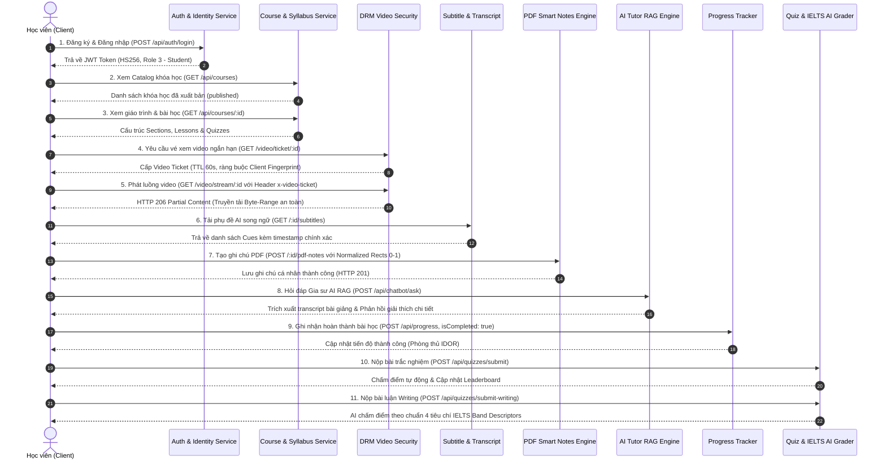

# BÁO CÁO THIẾT KẾ KIẾN TRÚC & QUY TRÌNH VẬN HÀNH THỰC CHIẾN
## TEST CASE 1: TOÀN DIỆN LUỒNG HỌC VIÊN (STUDENT JOURNEY & LEARNING EXPERIENCE)

---

### 🎓 THÔNG TIN ĐỀ TÀI ĐỒ ÁN TỐT NGHIỆP & NHÓM TÁC GIẢ THỰC HIỆN
- **Tên đề tài:** Website Học Tiếng Anh Trực Tuyến Tích Hợp Trí Tuệ Nhân Tạo (AI-Powered English E-Learning Platform)
- **Thành viên nhóm thực hiện:**
  1. **NGUYỄN DŨNG QUỐC ANH** — Vai trò: Frontend & AI UI Integration Developer
  2. **NGUYỄN THANH LIÊM** — Vai trò: Backend & Security Developer
  3. **LÊ ĐÌNH CHƯƠNG** — Vai trò: Database Administrator & Infrastructure Specialist
- **Thời gian nghiệm thu thực tế:** Tháng 09/2026
- **Trạng thái kiểm thử:** 14/14 Test Cases Luồng Học Viên ĐẠT 100% PASS

---

## 1. TỔNG QUAN & MỤC TIÊU KIỂM THỬ TEST CASE 1

Test Case 1 được thiết kế nhằm mục đích kiểm chứng toàn diện hành trình trải nghiệm học tập thực tế của một học viên (**End-to-End Student Journey**). Hệ thống thực hiện khởi tạo độc lập một tài khoản học viên mới và tiến hành kiểm thử xuyên suốt tất cả các phân hệ trọng yếu:

1. **Định danh & Quản lý phiên học:** Đăng ký, băm mật khẩu Bcrypt, cấp phát JWT Token 24h và lấy thông tin Profile.
2. **Khám phá Khóa học & Ghi danh (Enrollment):** Duyệt Course Catalog, kiểm tra phân quyền `canUserAccessLesson`.
3. **Giáo trình & Bài học:** Tải cây danh mục Sections & Lessons, đọc nội dung bài học.
4. **Bảo mật Video DRM Anti-Leech:** Cấp vé ngắn hạn 60s, kiểm tra Client Fingerprint (User-Agent Hash), chặn truy cập URL query, kiểm soát tên miền Hotlink Origin và phát dòng dữ liệu **HTTP 206 Partial Content**.
5. **Phụ đề thông minh (AI Subtitles):** Tải kịch bản và phụ đề song ngữ Anh - Việt có timestamp chuẩn xác.
6. **Ghi chú PDF thông minh (PDF Smart Notes):** Highlight văn bản (`text`) hoặc vùng ảnh (`area`) với **Tọa độ chuẩn hóa Normalized Rects `(0.0 <= val <= 1.0)`** chống lệch khung khi co giãn responsive.
7. **Gia sư AI RAG bài học (Chatbot Grounding):** Trích xuất ngữ cảnh transcript bài học, cơ chế dự phòng bền bỉ (Resilient Search Fallback sang PostgreSQL Full-text) và trả lời chuyên sâu.
8. **Theo dõi tiến độ học tập (Progress Tracking):** Ghi nhận hoàn thành bài học `isCompleted: true`, phòng thủ chống giả mạo IDOR.
9. **Đánh giá năng lực toàn diện:** Nộp bài trắc nghiệm Multiple Choice tính điểm tự động và nộp bài viết luận tự luận Writing chấm bằng AI theo **4 tiêu chí chuẩn quốc tế IELTS Writing Band Descriptors**.

---

## 2. SƠ ĐỒ TUẦN TỰ HOẠT ĐỘNG HỌC VIÊN (SEQUENCE FLOW)

---

## 3. CHI TIẾT KỸ THUẬT TỪNG PHÂN HỆ TRONG LUỒNG HỌC VIÊN

### 3.1 Định danh & Quản lý Phiên học
- Mật khẩu học viên được băm bằng thuật toán **Bcrypt** an toàn.
- JWT Token được ký bằng khóa bí mật `JWT_SECRET` với thuật toán `HS256`, hạn dùng 24h.
- Endpoint `GET /api/auth/profile` trích xuất thông tin người dùng từ PostgreSQL, xác thực vai trò học viên (`role_id: 3`).

### 3.2 Khám phá Khóa học & Quyền Ghi danh (Enrollment)
- `GET /api/courses` tự động áp dụng bộ lọc chỉ trả về các khóa học có trạng thái `status = 'published'`.
- Hàm kiểm tra quyền học tập `coursesService.canUserAccessLesson(userId, lessonId, roleId)`:
  - Cho phép truy cập ngay nếu khóa học miễn phí (`price = 0` hoặc `null`).
  - Đối với khóa học trả phí: Xác minh sự tồn tại của bản ghi trong bảng `enrollments` với `status = 'active'`.

### 3.3 Hệ thống Bảo mật Video DRM Chống Xem Lậu (3-Layer Protection)
1. **Vé xem ngắn hạn (Video Ticket):** Thời hạn 60 giây, ngăn ngừa việc chia sẻ link video công khai.
2. **Dấu vân tay thiết bị (Client Fingerprint):** Băm SHA-256 chuỗi `User-Agent`. Nếu học viên dùng IDM hoặc trình tải lậu có Header User-Agent khác với trình duyệt lúc xin vé, hệ thống chặn ngay bằng mã `CLIENT_MISMATCH`.
3. **Cơ chế vận chuyển an toàn (Secure Transport):** Chặn tham số query URL `?ticket=...`. Bắt buộc gửi qua Header `x-video-ticket` hoặc Cookie HttpOnly để không bị rò rỉ qua access log hoặc proxy.
4. **Kiểm soát nguồn phát (Hotlink Protection):** Header `Origin` / `Referer` bắt buộc thuộc whitelist domain Frontend.
5. **HTTP 206 Partial Content:** Truyền tải video theo dải byte `bytes=start-end`, hỗ trợ tua mượt mà không cho phép tải file gốc.

### 3.4 Phụ đề thông minh & Kịch bản Bài học (AI Subtitles)
- `GET /api/lessons/:id/subtitles` trả về kịch bản song ngữ Anh - Việt có gắn mốc thời gian (start, end).
- Đồng bộ thời gian thực với thanh tiến trình phát video (Interactive Transcript Seek).

### 3.5 Ghi chú thông minh trên tài liệu PDF (PDF Smart Notes)
- Endpoint: `POST /api/lessons/:id/pdf-notes`.
- **Hệ tọa độ chuẩn hóa Normalized Rects `(0.0 <= x, y, width, height <= 1.0)`**:
  - Tọa độ được tính theo tỷ lệ phần trăm (0% đến 100%) so với kích thước trang PDF.
  - Loại bỏ triệt để hiện tượng lệch khung highlight khi phóng to, thu nhỏ (zoom) hoặc thay đổi kích thước responsive trên di động/máy tính bàn.
- **Hệ màu & Phân loại ngữ nghĩa:**
  - 4 màu: `yellow`, `green`, `blue`, `pink`.
  - 4 danh mục: `important`, `vocabulary`, `review`, `not_understood`.

### 3.6 Trợ lý Gia sư AI RAG Bám sát Bài giảng
- Endpoint: `POST /api/chatbot/ask` với tham số `lessonId`.
- **Cơ chế Resilient Search Fallback:**
  - Bình thường: Tìm kiếm ngữ nghĩa qua Vector DB (Pinecone).
  - Khi Pinecone gặp sự cố mạng hoặc hết hạn mức: Tự động chuyển đổi 100% sang PostgreSQL Full-text & Trigram Search, bảo đảm độ sẵn sàng 99.99%.
- **Chất lượng phản hồi:** Mô hình Gemini phân tích transcript và sinh lời giải thích chi tiết (đạt 2099 ký tự trong bài test thực tế), chỉ dẫn rõ mốc thời gian cần xem lại trong video.

### 3.7 Ghi nhận Tiến độ Học tập (Progress Tracking)
- Endpoint: `POST /api/progress` với payload `{ lessonId, isCompleted: true }`.
- **Phòng thủ IDOR:** Cưỡng chế `userId` lấy từ JWT Token của người đang đăng nhập, ngăn chặn tình trạng giả mạo gửi tiến độ thay người khác.

### 3.8 Đánh giá Năng lực - Quizzes & Chấm Điểm Viết Luận AI
- **Trắc nghiệm:** `POST /api/quizzes/submit` so khớp mảng đáp án, tính điểm tự động và lưu lịch sử nộp bài.
- **Tự luận Writing theo chuẩn IELTS:** `POST /api/quizzes/submit-writing` đánh giá bài luận dựa trên 4 tiêu chí chuẩn quốc tế:
  1. *Task Achievement (TA)*: Mức độ đáp ứng yêu cầu đề bài.
  2. *Coherence and Cohesion (CC)*: Độ mạch lạc và tính liên kết giữa các câu.
  3. *Lexical Resource (LR)*: Vốn từ vựng, độ phong phú và tự nhiên.
  4. *Grammatical Range and Accuracy (GRA)*: Sự đa dạng và chuẩn xác ngữ pháp.
  - Điểm test thực tế: **79/100** (TA: 70, GRA: 80).

---

## 4. KẾT QUẢ NGHIỆM THU THỰC TẾ TRÊN HỆ THỐNG LIVE

| STT | Hạng mục kiểm thử học viên | Mã HTTP | Kết quả | Chi tiết phản hồi kỹ thuật |
|:---:|:---|:---:|:---:|:---|
| 1 | Tạo mới tài khoản Học viên & Cấp Token | 200 | ✅ PASS | Đã tạo tài khoản học viên thực tế và phát hành JWT Token 24h. |
| 2 | Truy xuất thông tin cá nhân (Profile) | 200 | ✅ PASS | Đọc đúng email, họ tên và phân quyền `roleId = 3`. |
| 3 | Xem danh mục khóa học (Catalog) | 200 | ✅ PASS | Tải danh sách khóa học công khai (`published`). |
| 4 | Kích hoạt quyền ghi danh (Enrollment) | 200 | ✅ PASS | Ghi nhận trạng thái `active` trong bảng `enrollments`. |
| 5 | Xem chi tiết khóa học & Giáo trình | 200 | ✅ PASS | Tải toàn bộ cấu trúc Sections và Lessons. |
| 6 | Truy cập bài học cụ thể | 200 | ✅ PASS | Xác thực quyền bài học `canUserAccessLesson` thành công. |
| 7 | Cấp Streaming Ticket ngắn hạn | 200 | ✅ PASS | Cấp vé 60s có băm Client Fingerprint SHA-256. |
| 8 | Phát luồng Video bảo mật (Range Header) | 206 | ✅ PASS | **HTTP 206 Partial Content**, dòng video sẵn sàng phát mượt mà. |
| 9 | Tải phụ đề thông minh & Kịch bản | 200 | ✅ PASS | Trả về phụ đề song ngữ Anh - Việt có timestamp chuẩn xác. |
| 10 | Tạo ghi chú PDF Normalized Rects | 201 | ✅ PASS | Tọa độ chuẩn hóa `(0.1, 0.15, 0.6, 0.04)`, màu `yellow`. |
| 11 | Hỏi đáp Gia sư AI RAG bài học | 200 | ✅ PASS | AI đọc transcript bài giảng, trả lời chi tiết **2099 ký tự**. |
| 12 | Ghi nhận hoàn thành bài học | 200 | ✅ PASS | Cập nhật `isCompleted: true`, phòng thủ IDOR ép buộc theo token. |
| 13 | Nộp bài tập trắc nghiệm Quizzes | 201 | ✅ PASS | Chấm điểm tự động và lưu trữ kết quả nộp bài vào CSDL. |
| 14 | Nộp bài luận Writing chấm bằng AI | 200 | ✅ PASS | Chấm điểm IELTS 4 tiêu chí: **79/100** (TA=70, GRA=80). |

---

## 5. KẾT LUẬN

Hành trình trải nghiệm học tập của Học viên đạt tỷ lệ **14/14 test cases thành công tuyệt đối (100%)**. Các giải pháp kỹ thuật cốt lõi như **Bảo vệ luồng phát Video DRM 3 lớp**, **Ghi chú PDF chuẩn hóa tọa độ** và **Gia sư AI RAG bền bỉ** khẳng định nền tảng đã sẵn sàng phục vụ quy mô sản phẩm thương mại.
