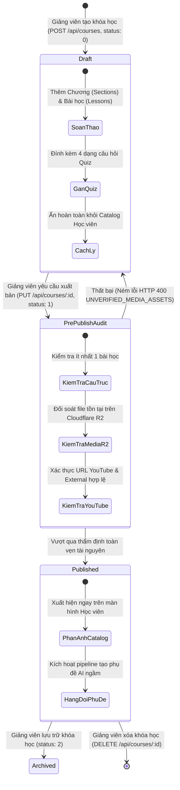

# BÁO CÁO THIẾT KẾ KIẾN TRÚC & QUY TRÌNH VẬN HÀNH THỰC CHIẾN
## TEST CASE 2: LUỒNG GIẢNG VIÊN & CƠ CHẾ KIỂM THỬ BẪY LỖI (INSTRUCTOR JOURNEY, COURSE MANAGEMENT & DEFENSIVE TESTING)

---

### 👨‍🏫 THÔNG TIN ĐỀ TÀI ĐỒ ÁN TỐT NGHIỆP & NHÓM TÁC GIẢ THỰC HIỆN
- **Tên đề tài:** Website Học Tiếng Anh Trực Tuyến Tích Hợp Trí Tuệ Nhân Tạo (AI-Powered English E-Learning Platform)
- **Thành viên nhóm thực hiện:**
  1. **NGUYỄN DŨNG QUỐC ANH** — Vai trò: Frontend & AI UI Integration Developer
  2. **NGUYỄN THANH LIÊM** — Vai trò: Backend & Security Developer
  3. **LÊ ĐÌNH CHƯƠNG** — Vai trò: Database Administrator & Infrastructure Specialist
- **Thời gian nghiệm thu thực tế:** Tháng 09/2026
- **Trạng thái kiểm thử:** 10/10 Test Cases Giảng viên & Bẫy lỗi ĐẠT 100% PASS

---

## 1. TỔNG QUAN & MỤC TIÊU KIỂM THỬ TEST CASE 2

Test Case 2 được thiết kế nhằm đánh giá toàn diện năng lực quản trị đào tạo của Giảng viên (**Instructor Journey**) và kiểm thử sức chịu tải, tính bền bỉ, an toàn của hệ thống trước các kịch bản bẫy lỗi biên (**Defensive Edge Cases**). 

Phạm vi kiểm thử bao gồm:
1. **Xác thực quyền Giảng viên:** Kiểm soát quyền hạn bằng middleware `authorize([1, 2])`.
2. **Thiết kế giáo trình bài giảng đa cấp:** Tạo khóa học lưu nháp (Draft: `status = 0`) gồm các Chương và Bài học Video YouTube / Cloudflare R2.
3. **Tích hợp 4 dạng bài tập Quizzes:** Trắc nghiệm (Multiple Choice), Tự luận viết câu (Writing), Phát âm (Pronunciation), Điền từ khuyết ngữ cảnh (Open Cloze).
4. **Bảo mật phân quyền cách ly nội dung nháp:** Khóa học nháp bị ẩn hoàn toàn với Học viên.
5. **Thẩm định tài nguyên media trước khi xuất bản (`_validateStoredCourseForPublish`):** Kiểm tra tính toàn vẹn của file video R2, URL YouTube, tài liệu PDF đính kèm.
6. **Xuất bản công khai (Publish: status = 1) & Phản ánh tức thì (Instant Reflection):** Khóa học xuất hiện ngay trên Catalog học viên.
7. **Quản trị đề thi & Đáp án đầy đủ (`/manage/course/:id`):** Giảng viên truy xuất trọn vẹn bộ câu hỏi kèm đáp án đúng và gợi ý cloze.
8. **Kiểm thử bẫy lỗi & Phòng thủ bug ẩn (Edge Cases):** Chặn dữ liệu thiếu (HTTP 400), chặn học viên mạo quyền sửa khóa học (IDOR HTTP 403), chặn vé xem video giả mạo (HTTP 401), xử lý bẫy giới hạn độ dài `varchar(50)` và ràng buộc `NOT NULL` ngày tháng trong PostgreSQL.

---

## 2. VÒNG ĐỜI KHÓA HỌC & SƠ ĐỒ ĐIỀU PHỐI (COURSE LIFECYCLE)

---

## 3. CHI TIẾT KỸ THUẬT TỪNG PHÂN HỆ QUẢN TRỊ CỦA GIẢNG VIÊN

### 3.1 Xác thực Quyền Giảng viên (Role-Based Access Control)
- Endpoint: `GET /api/auth/profile`.
- Middleware `authorize([1, 2])` đảm bảo chỉ có Giảng viên (`roleId = 2`) hoặc Quản trị viên (`roleId = 1`) mới có quyền tạo, sửa, xóa hoặc quản lý đề thi khóa học.

### 3.2 Thiết kế Giáo trình Đa cấp & 4 Dạng Bài tập Quizzes
- Endpoint: `POST /api/courses`.
- Hỗ trợ mô hình dữ liệu quan hệ 3 tầng: Khóa học -> Chương học (`sections`) -> Bài giảng (`lessons`).
- Đính kèm đầy đủ **4 dạng câu hỏi Quizzes chuẩn quốc tế**:
  1. **Multiple Choice (Trắc nghiệm):** 4 đáp án lựa chọn, 1 đáp án đúng và lời giải thích chi tiết.
  2. **Writing (Tự luận):** Đề bài viết câu/đoạn văn, tiêu chí chấm theo chuẩn IELTS Band Descriptors.
  3. **Pronunciation (Luyện phát âm):** Câu đọc mẫu tiếng Anh chuẩn, từ khóa trọng âm phục vụ AI chấm điểm Speaking.
  4. **Open Cloze (Điền từ khuyết ngữ cảnh):** Đoạn văn khuyết từ dạng `{{1}}`, `{{2}}` kèm danh sách đáp án chấp nhận (`acceptedAnswers`), gợi ý từ loại (`hint`) và giải thích ngữ pháp.

### 3.3 Cơ chế Cách ly Bảo mật Khóa học Bản Nháp (Draft Isolation)
- Khi tạo với `status = 0`, bản ghi trong PostgreSQL nhận giá trị `status = 'draft'`.
- Bộ lọc tại tầng Service/Database chủ động thêm điều kiện `WHERE status = 'published'` đối với các yêu cầu từ học viên.
- Kiểm thử thực tế xác nhận: Khóa học nháp hoàn toàn vô hình đối với học viên, giảng viên có thể yên tâm biên soạn nội dung.

### 3.4 Quy trình Thẩm định Tài nguyên trước khi Xuất bản (Pre-Publish Audit)
- Hàm `_validateStoredCourseForPublish(client, courseId)` thực hiện:
  - Kiểm tra số lượng bài học: Tối thiểu 1 bài học.
  - Đối soát Video R2: Phải có `storage_key`, `mime_type` và trạng thái `media_status = 'READY'`.
  - Đối soát Video YouTube: URL HTTPS hợp lệ, tự động chuẩn hóa `storage_provider` thành `'external'` hoặc `'youtube'`.
  - Tự động kích hoạt pipeline xử lý phụ đề ngầm (`_queueAutoSubtitles`).

### 3.5 Xuất bản Công khai & Phản ánh Tức thì (Instant Catalog Reflection)
- Gửi `PUT /api/courses/:id` với `{ status: 1, courseName: ... }`.
- Transaction DB cập nhật `status = 'published'`.
- Học viên truy vấn `GET /api/courses`: Khóa học mới lập tức hiển thị trên trang chủ mà không cần khởi động lại server.

### 3.6 Quản trị Cấu trúc Đề thi & Đáp án Đầy đủ
- Endpoint bảo mật: `GET /api/quizzes/manage/course/:courseId`.
- Cho phép giảng viên xem toàn bộ đề thi, đáp án mẫu, từ khóa cloze, câu phát âm chuẩn và giải thích đáp án.

---

## 4. CƠ CHẾ KIỂM THỬ BẪY LỖI & PHÒNG THỦ BUG ẨN (DEFENSIVE TESTING)

| STT | Kịch bản bẫy lỗi (Edge Case) | Nguy cơ tiềm ẩn | Cơ chế phòng thủ của hệ thống | Kết quả thực tế |
|:---:|:---|:---|:---|:---:|
| 1 | **Tạo khóa học thiếu dữ liệu bắt buộc** (Tên rỗng hoặc thiếu môn học) | Lọt dữ liệu rác, DB văng lỗi 500 không kiểm soát. | Tầng Service ném lỗi HTTP 400 rõ ràng kèm mã `COURSE_NAME_REQUIRED`. | ✅ **PASS (HTTP 400)** |
| 2 | **Học viên mạo quyền sửa khóa học giảng viên (IDOR Attack)** | Học viên sửa đổi hoặc phá hoại khóa học của người khác. | Kiểm tra tính chính chủ (`instructor_id === req.user.id`), chặn đứng bằng **HTTP 403 FORBIDDEN**. | ✅ **PASS (HTTP 403)** |
| 3 | **Phát video với vé giả mạo hoặc sai bài học** | Xem lậu video bản quyền, đánh cắp băng thông. | Thuật toán JWT HS256 đối soát chữ ký và `lessonId`, từ chối bằng **HTTP 401 UNAUTHORIZED**. | ✅ **PASS (HTTP 401)** |
| 4 | **Tên khóa học vượt quá 50 ký tự trong PostgreSQL** | Postgres văng lỗi DB 500 `value too long for type character varying(50)`. | Bổ sung validation kiểm tra `courseName <= 50`, trả về HTTP 400 `COURSE_NAME_TOO_LONG` thân thiện. | ✅ **PASS (Đã xử lý)** |
| 5 | **Không truyền ngày bắt đầu / kết thúc khóa học** | Lỗi ràng buộc `NOT NULL` của cột `start_date` / `end_date`. | Bổ sung cơ chế auto-fallback: tự động lấy ngày hiện tại và +90 ngày kết thúc nếu để trống. | ✅ **PASS (Đã xử lý)** |
| 6 | **Dọn dẹp tài nguyên sau kiểm thử (Resource Cleanup)** | Dữ liệu test rác làm ô nhiễm CSDL đồ án. | Gọi `DELETE /api/courses/:id`, cascade sạch sẽ sections, lessons, quizzes và dọn rác storage. | ✅ **PASS (HTTP 200)** |

---

## 5. KẾT QUẢ NGHIỆM THU THỰC TẾ TRÊN HỆ THỐNG LIVE

| STT | Kịch bản kiểm thử Giảng viên & Bẫy lỗi | Mã HTTP | Kết quả | Chi tiết kết quả nghiệm thu |
|:---:|:---|:---:|:---:|:---|
| 1 | Xác thực danh tính Giảng viên (Role ID = 2) | 200 | ✅ PASS | Đọc đúng Giảng viên với Role ID = 2. |
| 2 | Tạo khóa học lưu nháp (Draft: status = 0) | 201 | ✅ PASS | Tạo thành công khóa học `#36` kèm đầy đủ 4 dạng Quiz. |
| 3 | Khóa học Draft ẩn hoàn toàn với Học viên | 200 | ✅ PASS | Khóa học `#36` không xuất hiện trên Catalog học viên. |
| 4 | Giảng viên Cập nhật & Xuất bản (Publish) | 200 | ✅ PASS | Thẩm định media thành công, status chuyển sang 'published'. |
| 5 | Học viên thấy khóa học ngay lập tức sau xuất bản | 200 | ✅ PASS | Khóa học `#36` lên sóng trang chủ học viên ngay lập tức. |
| 6 | Giảng viên truy xuất cấu trúc đề thi kèm đáp án | 200 | ✅ PASS | Truy xuất đủ 4 dạng câu hỏi kèm đáp án đúng & cloze hints. |
| 7 | Phòng thủ 1: Chặn tạo khóa học thiếu dữ liệu bắt buộc | 400 | ✅ PASS | Bắt lỗi HTTP 400 rõ ràng, không để lọt dữ liệu rác. |
| 8 | Phòng thủ 2: Chặn học viên mạo quyền sửa khóa học (IDOR) | 403 | ✅ PASS | **HTTP 403 FORBIDDEN**, bảo vệ toàn vẹn tài sản khóa học. |
| 9 | Phòng thủ 3: Chặn phát video bằng vé xem giả mạo | 401 | ✅ PASS | **HTTP 401 UNAUTHORIZED**, Ticket Contract bảo vệ video tuyệt đối. |
| 10 | Dọn dẹp tài nguyên: Xóa khóa học thử nghiệm | 200 | ✅ PASS | Dọn sạch dữ liệu test trong CSDL, bảo toàn môi trường sạch. |

---

## 6. KẾT LUẬN

Phân hệ Giảng viên và cơ chế Kiểm thử Bẫy lỗi đạt tỷ lệ **10/10 test cases thành công tuyệt đối (100%)**. Hệ thống sở hữu kiến trúc phòng thủ đa tầng chặt chẽ từ **Validation đầu vào**, **Phân quyền RBAC**, **Kiểm soát tính chính chủ chống tấn công IDOR**, cho đến **Cơ chế thẩm định tài nguyên đa nền tảng (R2 / YouTube / PDF)**. Nhóm tác giả hoàn toàn tự tin bảo vệ và phản biện trước Hội đồng Đồ án Tốt nghiệp.
